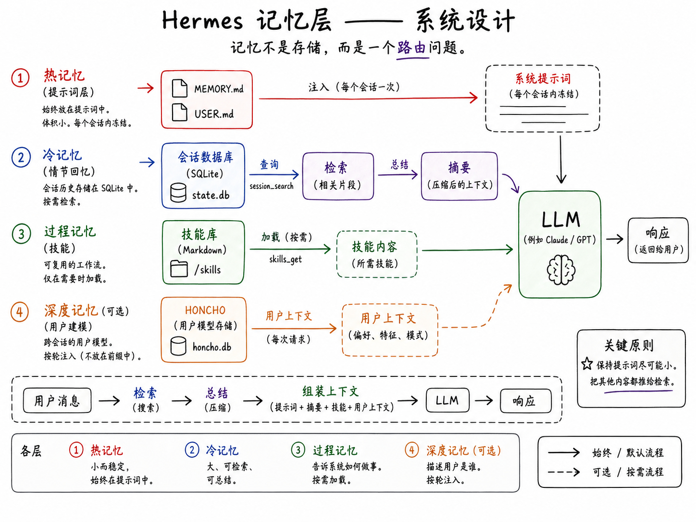

# Hermes Agent 记忆系统架构

> Hermes Agent 采用分层记忆架构，核心设计原则：**保持提示词稳定以利用缓存，其他信息按需检索**。不是一套记忆系统，而是四套协同工作的系统。



## 核心设计哲学

Hermes 针对供应商侧 **Prompt Caching** 优化：系统提示词的前缀部分（工具定义、记忆快照、技能索引等）在会话中保持不变，避免频繁变更导致缓存失效。

如果信息每一轮都需要 → 缩小注入提示词
如果信息量大、偶尔需要 → 踢出提示词，按需检索

## 系统提示词组装顺序

```
[0] 默认智能体身份
[1] 工具使用行为指南
[2] Honcho 集成模块（可选）
[3] 可选系统消息
[4] 固化 MEMORY.md 快照
[5] 固化 USER.md 快照
[6] 技能索引
[7] 上下文文件（AGENTS.md, SOUL.md, .cursorrules 等）
[8] 日期/时间 + 平台信息
[9] 对话历史
[10] 当前用户消息
```

## 四层记忆系统

### 1. 提示词记忆（Prompt Memory）— 热记忆

存储位置：`~/.hermes/memories/`

| 文件 | 用途 | 容量限制 |
|------|------|----------|
| `MEMORY.md` | 智能体笔记：环境、规范、工具怪癖、教训 | 2,200 字符 |
| `USER.md` | 用户画像：偏好、沟通风格、身份 | 1,375 字符 |

**设计特点：**
- 使用**字符限制**而非 Token 限制 → 模型无关
- 条目用 `§` 分隔的纯文本格式 → 简单可读
- 会话开始时加载并**固化快照** → 中途写入不改变当前提示词
- 记忆是**精选状态**（curated state），不是日记

**保存 vs 不保存：**
- ✅ 用户偏好、环境事实、反复修正、稳定规范
- ❌ 任务进度、会话结果、临时 TODO

**安全机制：** 拦截 Prompt Injection、凭证泄露、SSH 后门、隐藏 Unicode 字符

管理工具：`memory(action=add|replace|remove)` — replace/remove 使用子字符串匹配，无需内部 ID

### 2. 会话搜索（session_search）— 情景回溯

存储位置：`~/.hermes/state.db`（SQLite）

```
FTS5 全文搜索 → 按会话分组 → 解析父子关系 → 截取匹配片段 → 辅助模型摘要 → 返回主模型
```

**与提示词记忆的分工：**
- `MEMORY.md` = 持久性事实（Semantic Memory）
- `session_search` = 情景性回溯（Episodic Recall）

### 3. 技能系统（Skills）— 程序记忆

存储位置：`~/.hermes/skills/`

- 可复用的知识文档和操作流程
- **惰性加载**：提示词中只放索引，需要时才加载完整内容
- 解决"如何做"的问题（Procedural Memory），而非"是什么"

### 4. Honcho 层 — 深层用户建模（可选）

- 跨设备、跨平台的记忆连续性
- 同时建模用户和 AI 自身
- 第一轮：织入缓存系统提示词
- 后续轮：附加在用户消息后面 → 保持缓存稳定

## 压缩与记忆冲刷（Memory Flush）

长对话需要压缩时，Hermes 先执行"记忆冲刷"：

```
长对话 → 发送冲刷指令 → 模型保存持久事实到 memory → 压缩旧轮次 → 重建 prompt → 继续
```

关键步骤：
1. 压缩前注入指令，让模型保存值得记住的内容
2. 运行额外模型调用，只开启 memory 工具
3. 压缩后重建系统提示词，从磁盘重新加载 memory
4. 冲刷的内容立即成为新的稳定快照

## 与 OpenClaw 的对比

| 维度 | OpenClaw | Hermes Agent |
|------|----------|-------------|
| 记忆存储 | Markdown 为主的存储 | 分层架构 |
| 主要事实来源 | 日志和长效文件 | 小型提示词 + SQLite |
| 记忆回溯 | 混合搜索存储笔记 | session_search FTS5 |
| 提示词记忆 | 有边界但更激进 | 严格限制（~1300 tokens） |
| 程序记忆 | — | Skills 系统 |
| 深层建模 | — | Honcho（可选） |
| 缓存意识 | 较弱 | 核心设计驱动 |

**核心区别：**
- OpenClaw = "记忆即知识库"
- Hermes = "热工作集 + 冷检索层"

## 总结：三层洞察

1. **冷热分离**：小规模热记忆 + 大规模冷检索，而非全塞进提示词
2. **缓存优先**：冻结快照、延迟更新、逐轮注入 Honcho、压缩重建 → 都服务于"不轻易变更提示词"
3. **记忆多样性**：语义记忆 + 情景回溯 + 程序记忆 + 深层建模 → 更贴近 Agent 实际需求

> "不是记住更多，而是在正确的层级、以正确的成本，记住正确的事情。"

## 相关页面

- [A2A 协议详解](a2a-protocol.md) — Agent 间通信协议
- [A2A vs MCP](a2a-vs-mcp.md) — Agent 协议对比
